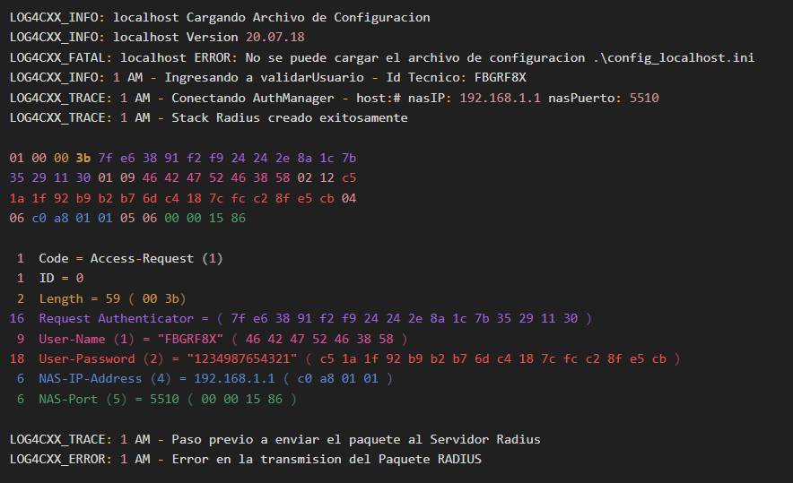

# Hexa Converter

Esto simularia el flujo de radius y convertiria el valor que hay q enviar a Hexadecimal y viceversa.

#### Estos son los parametros que se le pasan:
Tecnico Id = "FBGRF8X"
Tecnico Pin = "1234"
Tecnico Token ="987654321"

#### Esto es un formato del log:

#### Datos a tener en cuenta de la cadena Hexadecimal:
- el primer campo siempre va ser el code, con 01

- el id va en la posicion 2  y arranca 00 ,va ir sumado por cada envio
- 
- el leng va en la posicion 3, es el leng de la cadena hexadecimal es el total de todo, sumandole su poicion. ej: aca daria 57 pero si sumo el par q cuenta la longitud da 59.
  01 00 00 3b 7f e6 38 91 f2 f9 24 24 2e 8a 1c 7b
  35 29 11 30 01 09 46 42 47 52 46 38 58 02 12 c5
  1a 1f 92 b9 b2 b7 6d c4 18 7c fc c2 8f e5 cb 04
  06 c0 a8 01 01 05 06 00 00 15 86

- el Request Authenticator va en la posicion 4 y siempre de longitud 16 pq es un hash del md5 (q son 16 bytes)

- el autenticator solo manda estos campos para la autenticacion, solo estos 4 atributos (user-name, user-password, NAS-IP-Address, NAS-Port) y desp lo restante para completar la cadena hexademial

- los campos para la autenticacion esta dividido por atributos. Este atributo esta compuesto por:
  (id) (longitud total del atributo) (dato)
  04 06 c0 a8 01 01
  la longitud es la sumatoria total del atributo incluyendose, como se ve en el ejemplo.

---------------------------------------------------------------------------------------------------------
## Documentacion Lean

Radius en AuthenticationManager
● Se obtienen los parámetros correspondientes a la conexión de Authentication Manager, desde
un archivo INI, el ultimo parámetro de la función es el valor por defecto:
    ◦ std::string host = reader->Get("AuthenticationManager", "servidor", "#");
    ◦ std::string secret = reader->Get("AuthenticationManager", "secret", "XXNB8Xde0YQgt9");
    ◦ std::string nasIP = reader->Get("AuthenticationManager", "nasIP", "192.168.1.1");
    ◦ std::string nasPuerto = reader->Get("AuthenticationManager", "nasPuerto", "5510");

● Se crea una instancia del cliente RadiusClientStack
    ◦ El constructor de este objeto abre un servidor UDP - nonblocking que recibe cualquier
    dirección / interface y cualquier puerto que el sistema operativo le asigne al socket.
        ▪   Crea el servidor con los datos obtenidos del reader:
            ● Se agrega conexión con el servidor Radius
                ◦ clienteRadius.addServer(host, D_RADIUS_AUTHENTICATION_PORT,
                RadiusSecret(secret));

● Se crea un paquete con el comando D_PACKET_ACCESS_REQUEST
RadiusPacket paqueteRadius(D_PACKET_ACCESS_REQUEST, clienteRadius);
    ◦ Radius packet code values (from RFC2865)
    ◦ #define D_PACKET_ACCESS_REQUEST 1
    ◦ #define D_PACKET_ACCESS_ACCEPT 2
    ◦ #define D_PACKET_ACCESS_REJECT 3
    ◦ #define D_PACKET_ACCOUNTING_REQUEST 4
    ◦ #define D_PACKET_ACCOUNTING_RESPONSE 5
    ◦ #define D_PACKET_ACCESS_CHALLENGE 11
    ◦ #define D_PACKET_STATUS_SERVER 12
    ◦ #define D_PACKET_STATUS_CLIENT 13
    ◦ #define D_PACKET_MAX_KNOWN_CODE 13
    ◦ Some global constants (following RFC definitions)
    ◦ #define D_RADIUS_PACKET_HEADER_LENGTH 20
    ◦ #define D_RADIUS_PACKET_MAX_LENGTH 4096
    ◦ #define D_AUTHENTICATOR_LENGTH 16
    ◦ Mensaje = Code, Packet Id, Len, randomAuthenticator
        ▪ Code = 1 (D_PACKET_ACCESS_REQUEST) :byte
        ▪ Packet Id = 1 (Numero de paquete, empieza por 0) :byte
        ▪ Len = D_RADIUS_PACKET_HEADER_LENGTH (20) :2 bytes
        ▪ randomAuthenticator = MD5(gethostname()+second:millisec) : 16 bytes

● Crea objetos RadiusAttribute para agregar atributos a paqueteRadius:
Descripciones de los atributos disponibles:
// the following table must be synchronized with definition of Attribute Types in CAttribute.h file
static const char *AttrTypeDescription[] =
{
"unknown", // 0
"User-Name", // 1
"User-Password", // 2
"CHAP-Password", // 3
"NAS-IP-Address", // 4
"NAS-Port", // 5
"Service-Type", // 6
"Framed-Protocol", // 7
"Framed-IP-Address", // 8
"Framed-IP-Netmask", // 9
"Framed-Routing", // 10
"Filter-Id", // 11
"Framed-MTU", // 12
"Framed-Compression", // 13
"Login-IP-Host", // 14
"Login-Service", // 15
"Login-TCP-Port", // 16
"unknown", // 17
"Reply-Message", // 18
"Callback-Number", // 19
"Callback-Id", // 20
"unknown", // 21
"Framed-Route", // 22
"Framed-IPX-Network", // 23
"State", // 24
"Class", // 25
"Vendor-Specific", // 26
"Session-Timeout", // 27
"Idle-Timeout", // 28
"Termination-Action", // 29
"Called-Station-Id", // 30
"Calling-Station-Id", // 31
"NAS-Identifier", // 32
"Proxy-State", // 33
"Login-LAT-Service", // 34
"Login-LAT-Node", // 35
"Login-LAT-Group", // 36
"Framed-AppleTalk-Link", // 37
"Framed-AppleTalk-Network", // 38
"Framed-AppleTalk-Zone", // 39
"Acct-Status-Type", // 40
"Acct-Delay-Time", // 41
"Acct-Input-Octets", // 42
"Acct-Output-Octets", // 43
"Acct-Session-Id", // 44
"Acct-Authentic", // 45
"Acct-Session-Time", // 46
"Acct-Input-Packets", // 47
"Acct-Output-Packets", // 48
"Acct-Terminate-Cause", // 49
"Acct-Multi-Session-Id", // 50
"Acct-Link-Count", // 51
"unknown", // 52
"unknown", // 53
"unknown", // 54
"unknown", // 55
"unknown", // 56
"unknown", // 57
"unknown", // 58
"unknown", // 59
"CHAP-Challenge", // 60
"NAS-Port-Type", // 61"Port-Limit", // 62
"Login-LAT-Port" // 63
};

Ids de los atributos (los machea con las descripciones):
// definition of Attribute Types from RFC2865
#define D_ATTR_USER_NAME 1
#define D_ATTR_USER_PASSWORD 2
#define D_ATTR_CHAP_PASSWORD 3
#define D_ATTR_NAS_IP_ADDRESS 4
#define D_ATTR_NAS_PORT 5
#define D_ATTR_SERVICE_TYPE 6
#define D_ATTR_FRAMED_PROTOCOL 7
#define D_ATTR_FRAMED_IP_ADDRESS 8
#define D_ATTR_FRAMED_IP_NETMASK 9
#define D_ATTR_FRAMED_ROUTING 10
#define D_ATTR_FILTER_ID 11
#define D_ATTR_FRAMED_MTU 12
#define D_ATTR_FRAMED_COMPRESSION 13
#define D_ATTR_LOGIN_IP_HOST 14
#define D_ATTR_LOGIN_SERVICE 15
#define D_ATTR_LOGIN_TCP_PORT 16
#define D_ATTR_OLD_PASSWORD 17
#define D_ATTR_REPLY_MESSAGE 18
#define D_ATTR_CALLBACK_NUMBER 19
#define D_ATTR_CALLBACK_ID 20
#define D_ATTR_FRAMED_ROUTE 22
#define D_ATTR_FRAMED_IPX_NETWORK 23
#define D_ATTR_STATE 24
#define D_ATTR_CLASS 25
#define D_ATTR_VENDOR_SPECIFIC 26
#define D_ATTR_SESSION_TIMEOUT 27
#define D_ATTR_IDLE_TIMEOUT 28
#define D_ATTR_TERMINATION_ACTION 29
#define D_ATTR_CALLED_STATION_ID 30
#define D_ATTR_CALLING_STATION_ID 31
#define D_ATTR_NAS_IDENTIFIER 32
#define D_ATTR_PROXY_STATE 33
#define D_ATTR_LOGIN_LAT_SERVICE 34
#define D_ATTR_LOGIN_LAT_NODE 35
#define D_ATTR_LOGIN_LAT_GROUP 36
#define D_ATTR_FRAMED_APPLETALK_LINK 37
#define D_ATTR_FRAMED_APPLETALK_NETWORK 38
#define D_ATTR_FRAMED_APPLETALK_ZONE 39

// types 40-59 are reserved for accounting - RFC2866
#define D_ATTR_CHAP_CHALLENGE 60
#define D_ATTR_NAS_PORT_TYPE 61
#define D_ATTR_PORT_LIMIT 62
#define D_ATTR_LOGIN_LAT_PROMPT 63

// definition of Attribute Types from RFC2866
#define D_ATTR_ACCT_STATUS_TYPE 40
#define D_ATTR_ACCT_DELAY_TIME 41
#define D_ATTR_ACCT_INPUT_OCTETS 42
#define D_ATTR_ACCT_OUTPUT_OCTETS 43
#define D_ATTR_ACCT_SESSION_ID 44
#define D_ATTR_ACCT_AUTHENTIC 45
#define D_ATTR_ACCT_SESSION_TIME 46
#define D_ATTR_ACCT_INPUT_PACKETS 47
#define D_ATTR_ACCT_OUTPUT_PACKETS 48
#define D_ATTR_ACCT_TERMINATE_CAUSE 49
#define D_ATTR_ACCT_MULTI_SESSION_ID 50
#define D_ATTR_ACCT_LINK_COUNT 51
#define D_ATTR_MAX_KNOWN_TYPE 63

Atributos que agrega
● De todos estos atributos agrega:
1. D_ATTR_USER_NAME = Tecnico Id : String
2. D_ATTR_USER_PASSWORD = pasword (Pin Tecnico + Token del Tecnico)
   1. Deber ser múltiplo de 16
      1. Rellena pasword hasta el limite de 16 octetos con 0
   2. Calcula MD5(secret+randomAuthenticator)
   3. Los 16 bytes resultantes del MD5 se “xorean” byte a byte con los 16 bytes del
      punto 2.
3. D_ATTR_NAS_IP_ADDRESS = inet_aton(nasIP)
4. D_ATTR_NAS_PORT = Entero de nasPuerto

(*)Los atributos son RadiusPacket dentro de paqueteRadius
   ▪ RadiusPacket paqueteRadius(D_PACKET_ACCESS_REQUEST, clienteRadius);

   estos paquetes van concatenando unos tras otro ajustando el len general con
   RadiusPacket::adjustLength(uint16_t p_length);

(*) La funcion RadiusPacket::dump() imprime por pantalla el paquete completo a enviar.

(*) El len de los atributos es de un byte
   
Tipo de respuesta definidas:
   #define D_PACKET_ACCESS_REQUEST 1
   #define D_PACKET_ACCESS_ACCEPT 2
   #define D_PACKET_ACCESS_REJECT 3
   #define D_PACKET_ACCOUNTING_REQUEST 4
   #define D_PACKET_ACCOUNTING_RESPONSE 5
   #define D_PACKET_ACCESS_CHALLENGE 11
   #define D_PACKET_STATUS_SERVER 12
   #define D_PACKET_STATUS_CLIENT 13
   #define D_PACKET_MAX_KNOWN_CODE 13

Tipo de respuesta esperadas una vez enviado el paquete:
   D_PACKET_ACCESS_ACCEPT:La autenticacion con Authentication Manager fue exitosa
   D_PACKET_ACCESS_REJECT:Fallo la autenticacion con Authentication Manager
   D_PACKET_ACCESS_CHALLENGE:Fallo la autenticacion con Authentication Manager